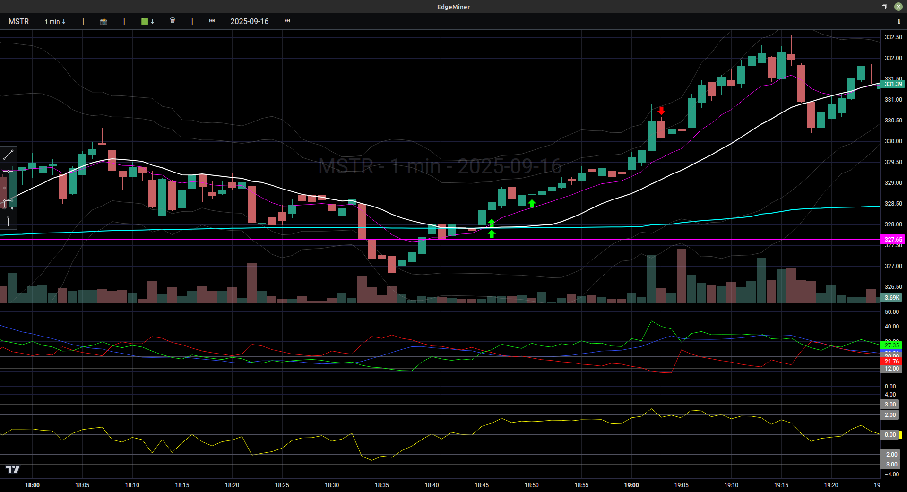
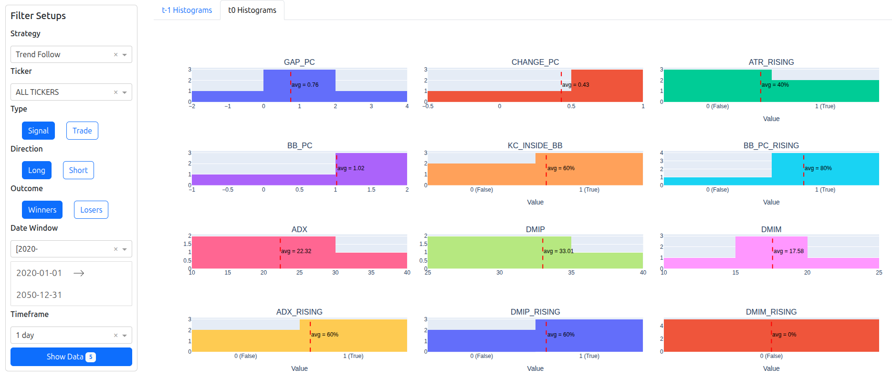

# About
**EdgeMiner** is a software to load historical charts and take screenshots and time slices of trading setups using the **Interactive Brokers Traders Workstation (TWS)/Gateway API**.

> _Plan the trade, follow the plan!_

This repository contains two tools.

## EdgeMiner
Charting tool based on **TradingView Lightweight-Charts** library. Load historical data from TWS and mark winning/losing trade entries based on your criteria.
All setups will be saved as **Pandas DataFrame JSON and CSV** file.



## Analysis
Plotly Dash application to analyze winning and losing trades.



# Install
This project comes with a **stable build** of the **TWS API**. If you want to build the API by your own, follow the [installation guide](./doc/install-api.md) and replace wheel file in the **dist** folder.
```
python -m venv .venv
source .venv/bin/activate
pip install -r requirements.txt
```
